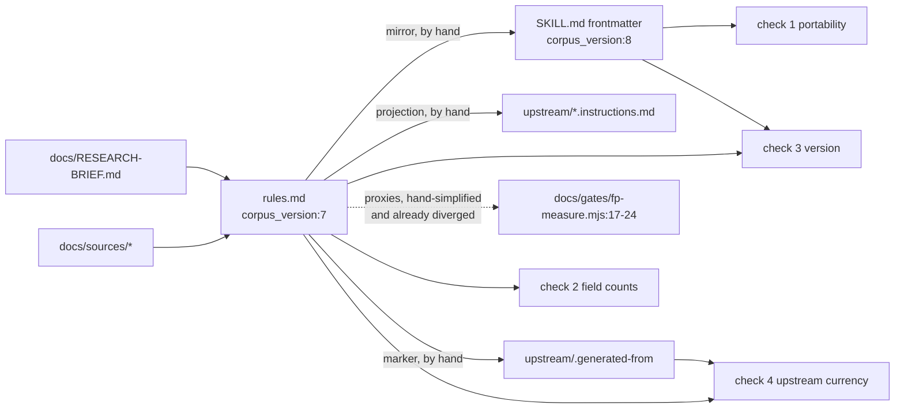

# Architecture review — 2026-09-02

A fresh-eyes read of the whole repository at commit `6af666e`: what the system is, how data
moves through it, where it is weak, and what was changed in the same pass. Every claim cites
a `file:line`. The pass changed **no behaviour of the shipped skill**; it touched only the
tooling around it (see §5).

The repository is not a large codebase. It holds **197 lines of executable code** across six
files and about 3,500 lines of markdown that *are* the product. So this review treats the
markdown package as the architecture and the code as its verification harness, because that
is what it is.

---

## 1. Architecture breakdown

### 1.1 Layers

| Layer | Contents | Shipped? |
|---|---|---|
| **Package** | `.claude/skills/devcontainers/SKILL.md` (router + procedures, 502 lines), `references/rules.md` (the twelve-rule corpus, the only rule authority), `references/spec-facts.md` (mechanics, 724 lines) | yes — read verbatim by Claude Code and Copilot |
| **Projections** | `upstream/awesome-copilot-devcontainers.instructions.md` (prose projection of the corpus) + `upstream/.generated-from` (provenance marker); `.github/instructions/devcontainers.instructions.md` (contentless pointer) | one is unsubmitted, one is untested |
| **Evidence** | `README.md` (decision record, 796 lines), `docs/RESEARCH-BRIEF.md`, `docs/sources/` (25 cached primary sources), `docs/gates/` (gates A–E), `docs/VERIFICATION.md`, `docs/plans/RESUME.md`, `docs/superpowers/plans/` | no |
| **Verification harness** | four shell checks written as prose in `README.md:251-308` and `CLAUDE.md:25-50`; `docs/gates/fp-measure.mjs` + `docs/gates/.harvest/{harvest,fetch}.sh` (Gate D, deferred) | no |
| **Workspace config** | seven byte-identical 150-line instruction files, six MCP configs, hooks for two hosts, four helper skills duplicated under `.claude/skills/` and `.gemini/skills/` | no |
| **Unrelated** | `tools/wf-preflight.mjs` — a Workflow-script linter that happens to live here | no |

### 1.2 Runtime data flow (an AUDIT request)

```mermaid
flowchart TD
  U[User request<br/>"review my devcontainer.json"] --> H[Host skill selection<br/>SKILL.md:2 description]
  H --> M[Mode table<br/>SKILL.md:18-22]
  M -->|AUDIT| R[Load rules.md ONLY<br/>SKILL.md:133]
  M -->|AUTHOR / DEBUG| S[Load spec-facts.md ONLY<br/>SKILL.md:276]
  R --> F[Find the config<br/>SKILL.md:42]
  F --> P[Probe tools, never install<br/>SKILL.md:58-78]
  P --> W[Walk twelve rules in corpus order<br/>SKILL.md:144 → rules.md:159-294]
  W --> B[Bucket each rule<br/>SKILL.md:176 reads the label list at SKILL.md:438]
  B --> O[Report: DC-XXX-NNN TIER SEVERITY<br/>SKILL.md:149, corpus_version from rules.md:7]
  S --> D[DEBUG branches<br/>SKILL.md:365-478]
  D -.->|"may open the corpus"| R
```

The load-bearing design decision is the **single-reference-per-mode** rule (`SKILL.md:27`):
AUDIT never sees `spec-facts.md`. That is why the not-label-storable list is pinned inside
`SKILL.md:438-440` and reproduced, not moved, in `spec-facts.md:353-372`. It is also the
source of the 500-line budget pressure the repo keeps hitting.

### 1.3 Build-time data flow (the corpus and its projections)



Every arrow labelled "by hand" is a place where the corpus and a derived artefact can drift.
Checks 3 and 4 catch two of them. Nothing catches the projection body or the Gate D proxies.

---

## 2. Critical problem areas

Ranked by how much damage they do per unit of neglect.

### P1 — The verification harness is prose, not code

The repo's own description is "correctness is enforced by greps" (`CLAUDE.md:8-9`), yet no
grep was runnable. The four checks exist as shell snippets in `README.md:251-308` and again in
`CLAUDE.md:25-50`, which is replicated into six more files (§P2), so **seven copies of the
same shell text**, none executable, none in CI. The `awk` fence-strip that the docs call
"load-bearing" (`CLAUDE.md:52-53`) was one typo away from being lost in any of those copies.

**Fixed in this pass:** `tools/check-skill.sh` is the single executable copy. It runs the
four documented checks plus a fifth (every `DC-` id cited inside the package resolves to a
heading in `rules.md`) and exits non-zero on any failure. Negative-tested against a
deliberately broken copy of the package: all five fail correctly.

### P2 — Workspace configuration fan-out with no source of truth

| Duplicate | Copies | Evidence |
|---|---|---|
| Project instructions | 7 identical (md5 `2aa81d93…`) | `CLAUDE.md`, `AGENTS.md`, `GEMINI.md`, `QODER.md`, `.windsurfrules`, `.kiro/steering/code-review-graph.md`; `.cursorrules` is a 38-line subset |
| MCP server config with absolute `cwd` | 6 | `.mcp.json:9`, `.vscode/mcp.json:9`, `.cursor/mcp.json:9`, `.kiro/settings/mcp.json:9`, `.qoder/mcp.json:9`, `.opencode.json:9` |
| Helper skills | 4 × 2 | `.claude/skills/{debug-issue,…}` vs `.gemini/skills/{…}` differ only in the `name:` line |
| Graph hooks | 2 hosts | `.claude/settings.json`, `.gemini/hooks/*.sh` |

The README sets a flip-trigger of "≥ 4 host-divergent files" before adopting a generator
(`README.md:634-645`) and scopes it to the skill, where the fan-out is genuinely two. For
workspace config the count is already seven, maintained by "editing one means syncing the
others" (`CLAUDE.md:101-102`). This is exactly the class of drift the package is designed to
prevent for rules, tolerated for its own configuration.

**Not fixed in this pass** — it needs a decision (§3.2).

### P3 — The Gate D harness measures proxies that no longer match the corpus

`docs/gates/fp-measure.mjs` carries four heuristics keyed by rule id. Three have drifted from
the `Detect` steps they stand in for, and one is not a rule at all:

| Heuristic | Divergence from `rules.md` |
|---|---|
| `DC-SEC-001` (`fp-measure.mjs:19-20`, original) | Keys on the **name** (`/TOKEN\|SECRET\|…/`). The corpus rule was rewritten after Gate E round 3 to key on the **value** — "The value decides, not the key" (`rules.md:181`) — precisely to eliminate the harm case the name-keyed form produced. The harness still encodes the harm case. |
| `DC-LIFE-001` (`:17-18`) | Regex lists `cargo build`, `mvn`, `gradle`; `Detect` lists `poetry install`, `cargo fetch`, `apt-get install`, `make` (`rules.md:165`). Neither is a subset of the other. |
| `DC-PERF-001` (`:21-22`) | Ignores the non-root `remoteUser`/`containerUser` precondition that `Detect` requires (`rules.md:240`). |
| `DC-FEAT-PIN` (`:23`) | Not a corpus id. The rule-id namespace is a published interface (`CLAUDE.md:87-88`); this id is a candidate that never entered `rules.md`. |

Gate D is deferred, so nothing has been measured wrongly yet. But the moment it runs as-is,
its false-positive rates will describe rules that do not exist in that form, and the README
will quote them as if they did.

**Partly fixed:** the harness is restructured so each heuristic carries an explicit
`proxyFor` field naming its divergence, and the header says outright that the numbers are
properties of the proxies. The regexes themselves are unchanged (changing what the harness
measures is a corpus decision, §3.3).

### P4 — Absolute paths in a public repository

`harvest.sh:7`, `fetch.sh:5-6`, `.gemini/hooks/*.sh:8`, `.claude/settings.json:9,21` and all
six MCP configs hardcode `/Users/emildan/work/devcontainers`. The README documents this for the
MCP configs (`README.md:786-788`) and for nothing else. A fresh clone would run the Gate D
scripts against a directory that does not exist, and the hooks would update a graph for a
repo that is not the one being edited.

**Fixed for scripts and hooks:** paths derive from `BASH_SOURCE`, `git rev-parse` or
`$CLAUDE_PROJECT_DIR`. MCP configs are left alone (their `cwd` field has no expansion
mechanism on most hosts) and remain documented.

### P5 — Correctness defects in the small code

- `wf-preflight.mjs:56,68` — a single `start` variable, not a stack, so a template literal
  nested inside `${…}` overwrites the outer literal's start offset and the outer literal is
  reported at the wrong line with the wrong length. Reproduced with a two-level fixture: the
  outer literal at line 3 was reported as line 4 with 2 lines instead of 3.
- `fp-measure.mjs:12` — the `//` stripper special-cases `://` so URLs survive, but any other
  `//` inside a string literal (`"a//b"`, `"note // not a comment"`) makes the file
  unparseable. The file's own warning admits this and asks the operator to watch the failure
  rate. A string-aware stripper is ~30 lines and removes the bias instead of measuring it.
- `wf-preflight.mjs:54` — an unterminated `/*` sets `i = -1 + 2 = 1` and rescans from the top;
  unreachable in practice because such a script fails check 1 first, but a latent loop.

**All three fixed.** These are the only two output-affecting changes in the pass (§5).

### P6 — Smaller maintainability issues

- `docs/gates/.harvest/` is gitignored (`.gitignore:6`) yet three files in it are tracked by
  force-add (`README.md:762-766`). Any contributor's `git add` on that directory is refused
  and the reason is only in a README paragraph. Negation patterns express the same intent
  in the ignore file itself.
- `.gemini/settings.json.bak` is committed.
- The word "twelve" appears in `SKILL.md:6,133,144,178,482`, `README.md`, and
  `upstream/.generated-from:8`. Check 2 verifies the *count*, not the *word*; a thirteenth rule
  needs a grep the docs do not mention.
- `SKILL.md` is at 502 lines against a 500-line guideline with a standing order never to
  reflow it (`CLAUDE.md:67-70`). That is a correct response to a real failure (four dropped
  enumeration items), but it means every future edit to AUDIT is a zero-sum line trade.

### What is *not* a problem

- The single-reference-per-mode rule and the duplicated label list are deliberate,
  documented, and correct for the stated constraint. Do not "deduplicate" them.
- `harvest.sh` is slow by design (42 shards × 7 s + retries ≈ the eight minutes the README
  cites) because GitHub code search is the bottleneck, not the script. `fetch.sh` is already
  parallel (`-P 10`). There is no compute-side performance problem anywhere in this repo.
- `docs/superpowers/plans/` and `RESUME.md` are large but they are the decision record the
  README depends on; they cost nothing at runtime.

---

## 3. Refactoring strategy

In order. Steps 1 is done; 2–6 are recommendations with the decision each one needs.

### 3.1 Done: make the harness executable and portable

`tools/check-skill.sh`, the script refactors, and the path fixes described in §5.

### 3.2 Collapse the workspace-config fan-out (needs a decision)

Recommendation: keep `AGENTS.md` as the single source and make `CLAUDE.md`, `GEMINI.md`,
`QODER.md`, `.windsurfrules` and `.kiro/steering/code-review-graph.md` **symlinks** to it.
Every host in the list reads a symlink as a file on macOS and Linux; no build step, no
generator, and `git` tracks the link. Adopt `rulesync` (which the README already names) only
if a host ever needs divergent content. `.cursorrules` stays a real file because it is a
subset by design.

Then point the "Checks to run" section at `tools/check-skill.sh` and delete the inline shell,
which removes the seventh copy of the fence-strip trick.

### 3.3 Re-derive the Gate D proxies from the corpus (needs a corpus decision)

Before Gate D runs: either align the four regexes with the current `Detect` text (and register
`DC-FEAT-PIN` as a real id or drop it), or accept that Gate D characterises proxies and say so
in `gate-d.md`. The `proxyFor` annotations added in this pass make either choice explicit.

### 3.4 Add the sixth check

The not-label-storable list lives in two files by design. A check that extracts the
back-ticked names from `SKILL.md:438-440` and the table rows in `spec-facts.md` and diffs them
is ten lines and closes the one documented duplication that nothing verifies.

### 3.5 Put the harness in CI

The repo is public. A single GitHub Actions job running `tools/check-skill.sh`,
`node --check` on the two `.mjs` files and `bash -n` on the four scripts costs nothing and
turns "all four currently pass" (`CLAUDE.md:27`) from a claim into a badge.

### 3.6 Express the harvest-artefact intent in `.gitignore`

Replace the force-add with:

```gitignore
docs/gates/fp-corpus/
docs/gates/.harvest/*
!docs/gates/.harvest/harvest.sh
!docs/gates/.harvest/fetch.sh
!docs/gates/.harvest/hits.uniq.tsv
```

---

## 4. Duplication report

| Concern | Locations | Verdict |
|---|---|---|
| The four checks as shell text | `README.md:251-308`, `CLAUDE.md:25-50` ×6 copies | accidental — consolidated into `tools/check-skill.sh`; prose copies remain until §3.2 |
| Project instructions | 7 files, byte-identical | accidental — host filename requirements, one content |
| MCP config with absolute `cwd` | 6 files | accidental but forced by host formats; documented |
| Helper skills | `.claude/skills/*` vs `.gemini/skills/*` | accidental — `name:` casing is the only delta |
| Not-label-storable list | `SKILL.md:438-440`, `spec-facts.md:353-372` | **legitimate** — AUDIT cannot load `spec-facts.md`; keep both, add a check |
| Rule content vs `upstream/` projection | `rules.md`, `upstream/*.instructions.md` | **legitimate** — the file leaves the repo; guarded by check 4 |
| Corpus `Detect` vs Gate D regexes | `rules.md`, `fp-measure.mjs` | accidental — see P3 |
| String-aware scanner | `fp-measure.mjs` `stripComments` / `stripTrailingCommas` | introduced here on purpose: two 20-line passes are easier to verify than one combined lexer |

---

## 5. What changed in this pass

All changes are uncommitted on `main`. Nothing under `.claude/skills/devcontainers/`,
`upstream/`, `README.md` or the instruction fan-out was touched.

| File | Change | Behaviour |
|---|---|---|
| `tools/check-skill.sh` | **new** — the five checks, exit-coded | n/a; passes on the current tree, fails correctly on a broken copy |
| `tools/wf-preflight.mjs` | split into `parseError`, `findMultilineTemplates`, `main`; named constants; template-start **stack** | identical output on parse-failure and clean fixtures; nested-template fixture now reports the correct outer line (P5) |
| `docs/gates/fp-measure.mjs` | string-aware JSONC stripper; heuristics as a table with `proxyFor`; `measure`/`report` split; usage message | identical counts on the original fixture set; a `//` inside a string now parses instead of counting as unparseable (P5). Output rows print in heuristic order rather than first-hit order |
| `docs/gates/.harvest/harvest.sh` | paths from `BASH_SOURCE`; `search_shard` function; named sleep/retry constants; documented outputs | same query, shards, retries, sleeps, files |
| `docs/gates/.harvest/fetch.sh` | paths from `BASH_SOURCE`; `local` variables; documented outputs | same dedupe, parallelism, manifest |
| `.gemini/hooks/*.sh` | repo from `git rev-parse` | same JSON on stdout; smoke-tested |
| `.claude/settings.json` | `${CLAUDE_PROJECT_DIR:-$PWD}` | same commands, portable |

Equivalence evidence: originals were copied aside and run against the same fixtures; the
diffs are exactly the two corrections listed above and nothing else.
